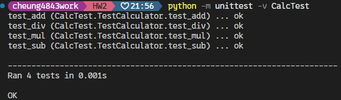
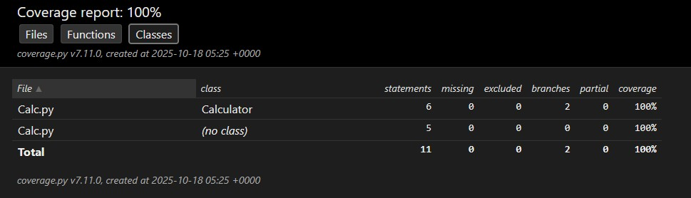
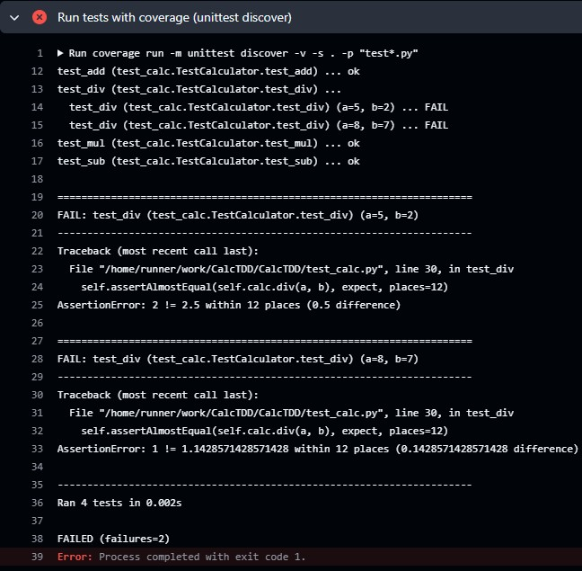

# HW2
[Github連結](https://github.com/cheung4843/CalcTDD)
## 前置作業
首先修改 `CalcTest.py` 的引入，改為 `from Calc import Calculator`，這樣才能正確引入。

## 減法
### 先寫測試
```python
    def test_sub(self):
        calc = Calculator()
        self.assertEqual(calc.sub(5, 2), 3)
        self.assertEqual(calc.sub(2, 5), -3)
```
接著執行測試，得到以下結果:
```
python -m unittest -v CalcTest
test_add (CalcTest.TestCalculator.test_add) ... ok
test_sub (CalcTest.TestCalculator.test_sub) ... ERROR

======================================================================
ERROR: test_sub (CalcTest.TestCalculator.test_sub)
----------------------------------------------------------------------
Traceback (most recent call last):
  File "C:\software testing\HW2\CalcTest.py", line 11, in test_sub
    self.assertEqual(calc.sub(5, 2), 3)
                     ^^^^^^^^
AttributeError: 'Calculator' object has no attribute 'sub'

----------------------------------------------------------------------
Ran 2 tests in 0.001s

FAILED (errors=1)
```

可以看到加法測試成功，而減法因為還沒實作，所以一定失敗。
### 實作
```python
def sub(self, a, b):
        return a - b
```

再進行測試:
```
python -m unittest -v CalcTest
test_add (CalcTest.TestCalculator.test_add) ... ok
test_sub (CalcTest.TestCalculator.test_sub) ... ok

----------------------------------------------------------------------
Ran 2 tests in 0.000s

OK
```
### 重構
目前程式架構還很清晰，不需要重構。
## 乘法
### 先寫測試
```python
    def test_mul(self):
        calc = Calculator()
        self.assertEqual(calc.mul(-2, -3), 6)
        self.assertAlmostEqual(calc.mul(0.48, 0.43), 0.2064)
```
接著執行測試，得到以下結果:
```
python -m unittest -v CalcTest
test_add (CalcTest.TestCalculator.test_add) ... ok
test_mul (CalcTest.TestCalculator.test_mul) ... ERROR
test_sub (CalcTest.TestCalculator.test_sub) ... ok

======================================================================
ERROR: test_mul (CalcTest.TestCalculator.test_mul)
----------------------------------------------------------------------
Traceback (most recent call last):
  File "C:\software testing\HW2\CalcTest.py", line 15, in test_mul
    self.assertEqual(calc.mul(-2, -3), 6)
                     ^^^^^^^^
AttributeError: 'Calculator' object has no attribute 'mul'

----------------------------------------------------------------------
Ran 3 tests in 0.001s

FAILED (errors=1)
```
## 實作
```python
def mul(self, a, b):
        return a * b
```
再進行測試:
```
python -m unittest -v CalcTest
test_add (CalcTest.TestCalculator.test_add) ... ok
test_mul (CalcTest.TestCalculator.test_mul) ... ok
test_sub (CalcTest.TestCalculator.test_sub) ... ok

----------------------------------------------------------------------
Ran 3 tests in 0.001s

OK
```
### 重構
目前程式架構還很清晰，不需要重構。
## 除法
在這裡，我們規範回傳類別為浮點數。
### 先寫測試
```python
    def test_div(self):
        calc = Calculator()
        self.assertAlmostEqual(calc.div(5, 2), 2.5)
        self.assertAlmostEqual(calc.div(8, 7), 1.14285714286)
        with self.assertRaises(ZeroDivisionError):
            calc.div(114514, 0)
```
進行測試:
```
test_add (CalcTest.TestCalculator.test_add) ... ok
test_div (CalcTest.TestCalculator.test_div) ... ERROR
test_mul (CalcTest.TestCalculator.test_mul) ... ok
test_sub (CalcTest.TestCalculator.test_sub) ... ok

======================================================================
ERROR: test_div (CalcTest.TestCalculator.test_div)
----------------------------------------------------------------------
Traceback (most recent call last):
  File "C:\software testing\HW2\CalcTest.py", line 19, in test_div
    self.assertAlmostEqual(calc.div(5, 2), 2.5)
                           ^^^^^^^^
AttributeError: 'Calculator' object has no attribute 'div'

----------------------------------------------------------------------
Ran 4 tests in 0.001s

FAILED (errors=1)
```
### 實作
```python
 def div(self, a, b):
        if b == 0:
            raise ZeroDivisionError("division by zero")
        return a / b # float
```
進行測試: 
```
python -m unittest -v CalcTest
test_add (CalcTest.TestCalculator.test_add) ... ok
test_div (CalcTest.TestCalculator.test_div) ... ok
test_mul (CalcTest.TestCalculator.test_mul) ... ok
test_sub (CalcTest.TestCalculator.test_sub) ... ok

----------------------------------------------------------------------
Ran 4 tests in 0.001s

OK
```
### 重構
由於每次要測試時都需要打 `python -m unittest -v CalcTest`，將 `CalcTest.py` 改名為 `test_calc.py` 這樣就可以不用指定檔案了，unittest 會自動去抓前綴為 `test` 的檔案。

接著也把測試中都要重複建立 `calc = Calculator()` 的動作，放在 `setUp(self)` 中，以及使用 table-driven 的方式去測試，例如 :

```python
def setUp(self):
  self.calc = Calculator()

def test_add(self):
  cases = [((2, 3), 5), ((-1, 1), 0), ((0, 0), 0)]
  for (a, b), expect in cases:
    with self.subTest(a=a, b=b):
      self.assertEqual(self.calc.add(a, b), expect)
```

而在實作 `Calc.py` 中加上了簡單的型別註解與 docstring，例如 : 

```python
class Calculator:
    """Simple four-operations calculator."""

    def add(self, a: float, b: float) -> float:
        return a + b

    def sub(self, a: float, b: float) -> float:
        return a - b
```


## 全部測試通過截圖


## CI 與覆蓋率


新增了 `.github/workflows/ci.yml` 並在其中使用了 `coverage` 來產生覆蓋率報告。分別在 Python 3.9~3.12 上都執行測試。 

在 CI artifact 中可以看到每次的報告，類似 : 


[當次推送結果](https://github.com/cheung4843/CalcTDD/actions/runs/18611365816/job/53069966604)

## 
接著來故意把原始碼寫壞，故意將除法中的 `return a / b` 改成 `return a // b`，接著再次 push，可以看到 CI 失敗了: 



接著我們來還原回 `return a / b`，並再次推送: 
